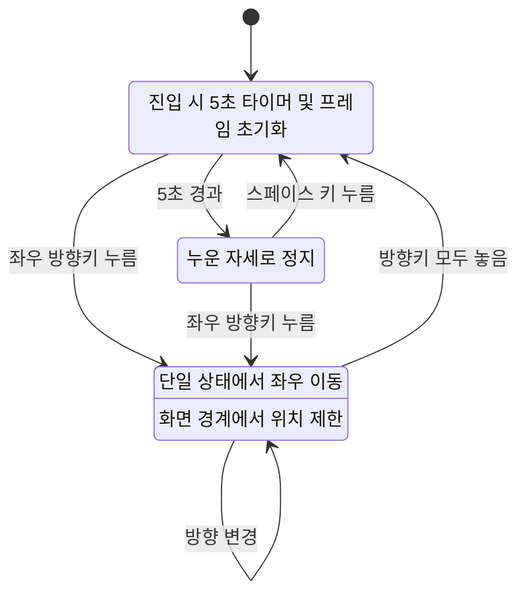

# Boy 상태 다이어그램

```mermaid
stateDiagram-v2
    [*] --> IDLE
    IDLE: 진입 시 5초 타이머 및 프레임 초기화
    SLEEP: 누운 자세로 정지
    IDLE --> SLEEP: 5초 경과
    SLEEP --> IDLE: 스페이스 키 누름
    RUN: 단일 상태에서 좌우 이동
    RUN: 화면 경계에서 위치 제한
    IDLE --> RUN: 좌우 방향키 누름
    RUN --> RUN: 방향 변경
    RUN --> IDLE: 방향키 모두 놓음
    SLEEP --> RUN: 좌우 방향키 누름
```

IDLE에 진입할 때마다 5초 타이머를 새로 시작합니다.
RUN은 좌우 공통 상태이며 `face_dir`로 방향을 구분합니다.
방향키를 모두 놓으면 IDLE로 돌아갑니다.
양쪽 방향키를 누르면 마지막에 누른 방향을 우선합니다.
SLEEP에서도 IDLE과 같은 방향키 처리로 RUN에 진입합니다.
